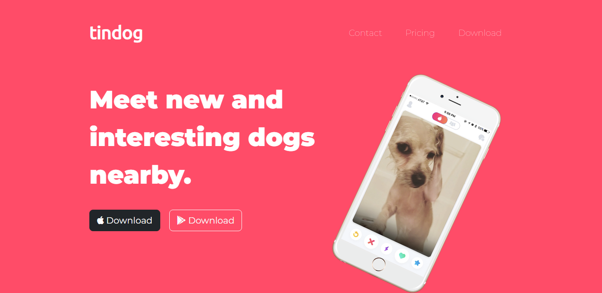
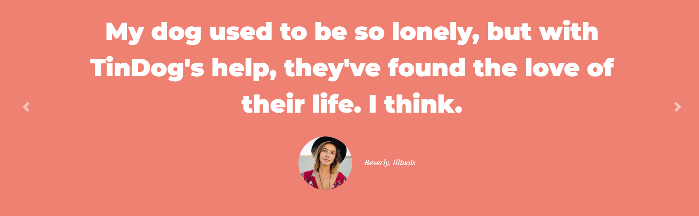

# TinDog
A landing page for tinder app made exclusively for Dogs.

# About TinDog
A landing page which provides details of the application to the end user like the desscription of the website, from where we can download the application, a section that displays the feedback from the clients and different plans and subscriptions.

# Tools Used
The main framework used in building the TinDog website is Bootstrap and its components like Carousel, Card, Buttons, Navbar etc. It also used HTML5, CSS3 and Google Fonts and Font Awesome.

# Screenshots

